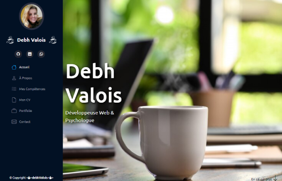

<h1 align="center">
  
  PORTFOLIO 2022
</h1>

 Status <☕>Fini<☕/> 

# HTML | CSS | JavaScript 

### Description
- Accueil | À Propos | Compétences | Mon CV | Portfolio | Contact | Présentation

## 📁 Accessibilité :
- Pour lire les codes sources, il suffit d'y accéder directement dans ce répô.
- Pour accéder à la page, cliquez sur l'image ci-dessous avec le *scroll* ou avec le bouton droit de le mouse pour ouvrir dans un nouvel onglet :

## :hammer_and_wrench: Technologies utilisées :

*HTML5* | *CSS3* | *JavaScript* | *Bootstrap*

## :octocat: L'auteure : 
<table>
  <tr>
    <td align="center">
      <a href="#">
         
        
          <b>Debh Valois</b>
        
      </a>
    </td>
  </tr>
</table>

