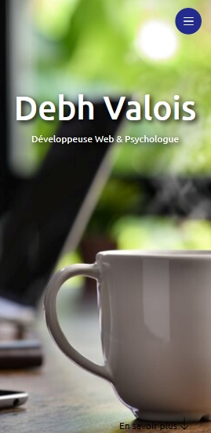

<h1 align="center">
  
  PORTFOLIO
</h1>

 Status <☕> Update 03 juin 2023 <☕/>

# 
### Description
- Accueil | À Propos | Compétences | Mon CV | Portfolio | Contact
## 📁 Accessibilité :
- Pour lire les codes sources, il suffit d'y accéder directement dans ce répô.
- Pour accéder à la page, cliquez sur l'image ci-dessous avec le *scroll* ou avec le bouton droit de le mouse pour ouvrir dans un nouvel onglet :
<table align="center">
  <tr>
    <td>
      
    </td>
  </tr>
</table>

## :hammer_and_wrench: Technologies utilisées :
# JavaScript | HTML5 | CSS3 | Bootstrap
## :octocat: L'auteure : 
<table>
  <tr>
    <td align="center">
      <a href="#">
         
        
          <b>Debh Valois</b>
        
      </a>
    </td>
  </tr>
</table>

